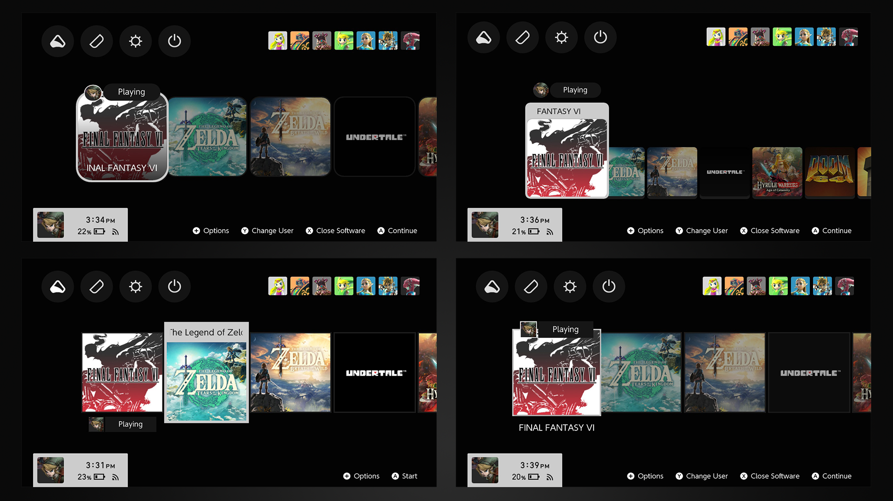
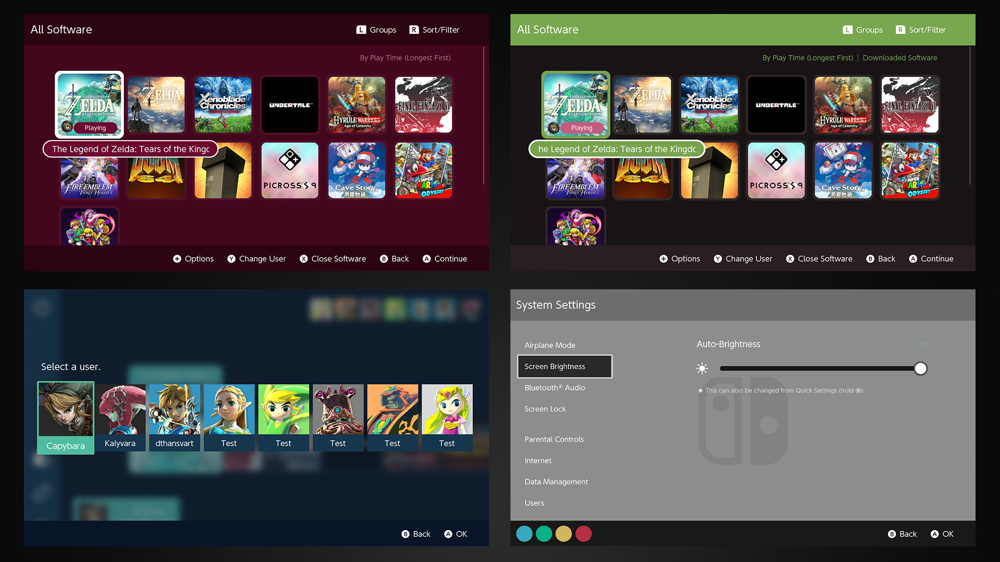

# Chroma, sleek themes for Nintendo Switch

Chroma is a NXTheme project that aims to (hopefully) bring sleek designs to your Switch interface, providing a collection of themes that share similar UI design criteria. The intent here was to turn one year's worth of accumulated knowledge in Switch theming into full-fledged and coherent theme packs. While I don't consider the end result anywhere near perfect, great attention has still been given to color consistency and details.

As of now, it comes in **7 layout variants for the home screen** (more specifically the games row), and it's pre-bundled with a few color schemes.

Contributors are always welcome, so feel free to fork this repository if you want to implement additional color schemes. Excluding bug reports, I won't be taking any requests.

**Important: set your console to dark mode before using Chroma** (System Settings > Themes > Basic Black)

## Features

**Layout variants (base layouts)**

Layouts listed here use 1:1 game icons. I don't plan on implementing vertical icons.

- **Default:** slightly inspired by the PS5 layout, icons are rounded and the highlighted game appears as a card. This layout leaves enough room to put a custom background image.
- **Default large icons:** same as right above with larger icons.
- **Default w/ sidebar for applet icons**
- **Compact rounded:** rounded icons. When a game is highlighted, its label overlaps the game's image.
- **Regular squared:** big squared icons. The focus animation when a game is highlighted is similar to what can be seen in SteamOS' Big Picture Mode.
- **Regular rounded:** same as right above but icons are rounded.
- **Cards:** similar to the default layout, but the games row is symmetrically aligned with the highlighted card, and icons are squared.

**Color schemes**

- **B&W** (base color scheme)
- **Terra:** earthy colors inspired by Monokai: light green, brown and hints of pink.
- **Terra Mint:** less vibrant tones than Terra with grayish brown, mint green and hints of beige.
- **Aqua:** aquamarine and deep blue colors.
- **Murasaki:** light purple with hints of beige and pale orange.
- **Neo Famicom:** gray tones and colored buttons inspired by the SNES console.
- **Red Wine:** scarlet tones with some gradients.

- (only home screen & player select) **Famicom:** wine red and beige colors, inspired by the Famicom console. Uses the default w/ sidebar layout.

## Download on Themezer

- [CHROMA default (B&W)](https://themezer.net/packs/CHROMA-682)
- [CHROMA Neo Famicom Ed.](https://themezer.net/packs/CHROMA-Neo-Famicom-Edition-683)
- [CHROMA Terra Ed.](https://themezer.net/packs/CHROMA-Terra-Edition-684)
- [CHROMA Terra Mint Ed.](https://themezer.net/packs/CHROMA-Terra-Mint-Edition-689)
- [CHROMA Aqua Ed.](https://themezer.net/packs/CHROMA-Aqua-Edition-685)
- [CHROMA Murasaki Ed.](https://themezer.net/packs/CHROMA-Murasaki-Edition-686)
- [CHROMA Red Wine Ed.](https://themezer.net/packs/CHROMA-Red-Wine-Edition-687)

## Quick showcase

## Theme editing

This repository contains the themes' source code as well as their assets. Before anything else, [check out the documentation](https://layoutdocs.themezer.net/) to learn more about editing layouts. Additionally, a wiki that explicits the specifics of those themes *might* be published at some point.

Now, please note that Chroma involves very intricate layouts as they massively rely on animations and convenient re-use of pre-existing UI elements (which is often the case with my NXTheme releases). You will most likely have a hard time to tweak those themes without breaking something. Also, most colors are dynamically handled (through animations) so making color changes isn't as straightforward as editing hex values within the JSON files. In fact, you will absolutely need Layout Editor for most of the UI.

**Credits would be greatly appreciated if you're planning to publicly share your edited theme.**

## Known issues

- Home menu crashes after uninstalling a game (under investigation)
- In the sidebar layout, the games scrolling will behave weirdly if the sidebar is accessed through some particular ways. It doesn't affect the navigation that much and there's a chance you won't even notice. This issue actually arose in Unison R as well, and unfortunately I have no solution to prevent this behavior.

## Changelog

Except for v1.0 which is a shared release, the versioning is independent for each color scheme.

### v1.0 (shared release)

Initial release (B&W, Aqua, Terra, Neo Famicom, Murasaki, Red Wine, Terra Mint)

## Credits

- Atmosphere icon in Chroma Terra Edition by [dh park](https://thenounproject.com/icon/leaf-5958752/)
- Atmosphere icon in Chroma Aqua Edition by [Viktor Vorobyev](https://thenounproject.com/icon/water-drop-504908/)
- Atmosphere icon in Chroma Murasaki Edition by [Cuputo](https://thenounproject.com/icon/book-4146408/)
- Atmosphere icon in all other variants by u/Quat0rz
- Switch controller SVG in Neo Famicom's lockscreen by [Chad Remsing](https://thenounproject.com/icon/switch-charging-controller-930118/)
- Special thanks to [LayoutDocs](https://layoutdocs.themezer.net/) contributors
